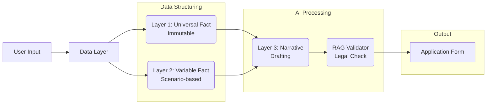

<div align="center">

# 🇰🇷 K-Stay
**Foreigner Visa Document Automation Platform**
<br/>
<em>"외국인의 복잡한 출입국 행정 서류, AI가 완벽하게 자동화합니다."</em>

<br/>


<br/>
<br/>

[🌐 Official Website ](https://k-stay.streamlit.app/) 

</div>

<br/>

## 📝 프로젝트 소개 (Overview)

**K-Stay**는 한국에 체류하는 외국인을 위한 **출입국 민원 서류 자동 생성 플랫폼**입니다.
복잡한 [별지 제34호 통합신청서 등의 서류]와 각종 사유서(구직활동계획서, 결혼배경진술서 등)를 하이코리아(HiKorea) 공식 양식에 맞춰 **자동 작성**하여 **ZIP 패키지**로 제공합니다.

### 🎯 Core Goals
* **One-Click Form**: 불변 정보(이름, 여권 등)는 가입 시 1회만 입력, 이후 모든 서류에 자동 매핑.
* **AI Active Validator**: 단순 입력이 아닌, AI가 "사유서"의 논리를 검토하고 "반려 위험 표현"을 능동적으로 교정.
* **Golden Six Scenarios**: 가장 수요가 높은 6가지 핵심 비자 시나리오(D-10, F-6 등) 완벽 대응.

<br/>

## 🏗 데이터 아키텍처 (Data Architecture)

K-Stay는 데이터의 성격에 따라 3계층(Layer)으로 분리하여 처리합니다.



| Layer | Type | Definition | AI Role |
| :--- | :--- | :--- | :--- |
| **Layer 1** | **Universal Fact** | 성명, 여권번호, 국적 등 평생 변하지 않는 **불변 정보** | ❌ (DB 매핑) |
| **Layer 2** | **Variable Fact** | 시나리오별(취업, 결혼 등) 달라지는 **상황 정보** | ❌ (Form 입력) |
| **Layer 3** | **Narrative** | 구직 계획, 초청 사유 등 설득이 필요한 **정성적 사연** | ✅ **Active Review** |

<br/>

## 🛠 기술 스택 (Tech Stack)

### Frontend & Application
* **Framework**: [Streamlit](https://streamlit.io/) (빠른 프로토타이핑 및 인터랙티브 웹앱 구현)
* **Language**: Python 3.9+

### Backend & Database
* **BaaS**: [Supabase](https://supabase.com/) (Auth, PostgreSQL, Storage)
* **User Data**: `users` (Universal Fact), `signatures` (서명 이미지)
* **Vector DB**: Pinecone / FAISS (법령 및 매뉴얼 RAG 검색용)

### AI & Logic
* **LLM**: OpenAI GPT-5 (Narrative 생성 및 검토)
* **Doc Processing**: `python-docx` (Word 템플릿 파싱 및 데이터 주입)
* **RAG Engine**: LangChain (하이코리아 매뉴얼, 출입국관리법 기반 질의응답)

### Payment
* **Gateway**: [Stripe](https://stripe.com/) (구독 및 단건 결제 처리, Webhook 연동)

<br/>


## 🗂 지원 시나리오 (Golden Six)

| Track | Scenario | Code | Key Documents (Auto-Generated) |
| :--- | :--- | :--- | :--- |
| **High Volume** | **구직 준비** | `D-10` | 구직활동계획서, 통합신청서, 거주숙소제공확인서 |
| | **아르바이트** | `Part-Time` | 시간제취업확인서, 요건준수확인서 |
| **High Margin** | **결혼 이민** | `F-6` | 결혼배경진술서(러브스토리), 배우자초청장 |
| | **가족 초청** | `F-1-5` | 가족초청장, 불법취업방지서약서 |
| **Recurring** | **전문 인력** | `E-7` | 고용사유서(필수성 증명), 사증발급인정신청서 |
| | **국적 귀화** | `Nat` | 귀화동기서, 귀화추천서 |

<br/>


## 🚀 실행 방법 (Getting Started)

### 1. 저장소 클론 (Clone)
```bash
git clone [https://github.com/korea-stay/k-stay.git](https://github.com/korea-stay/k-stay.git)
cd k-stay

```

### 2. 가상환경 설정 (Venv)

```bash
python -m venv venv
source venv/bin/activate  # Windows: venv\Scripts\activate

```

### 3. 환경 변수 설정 (.env)

프로젝트 루트에 `.env` 파일을 생성하고 아래 내용을 채워주세요. (필수)

```ini
# .env file

# 1. OpenAI (Intelligence)
OPENAI_API_KEY=sk-proj-xxxxxxxxxxxxxxxxxxxxxxxx

# 2. Supabase (Database & Auth)
SUPABASE_URL=[https://your-project.supabase.co](https://your-project.supabase.co)
SUPABASE_KEY=eyJhbGciOiJIUzI1NiIsInR5cCI6Ik... (Service Role or Anon Key)

# 3. Stripe (Payment)
STRIPE_API_KEY= _test_xxxxxxxxxxxxxxxxxxxxxx(
STRIPE_WEBHOOK_SECRET=whsec_xxxxxxxxxxxxxxxxxx (Optional for Webhook)

# 4. RAG / Vector DB (Optional)
PINECONE_API_KEY=xxxxxxxx-xxxx-xxxx-xxxx-xxxxxxxxxxxx
PINECONE_ENV=gcp-starter

```

### 4. 템플릿 준비 (Templates)

`templates/` 폴더 내에 하이코리아 공식 `.docx` 파일들이 위치해야 합니다.

* `templates/통합신청서_34호.docx`
* `templates/구직활동계획서.docx`
* ... (기타 서식)

### 5. 서버 실행 (Run)

Streamlit을 사용하여 웹 애플리케이션을 실행합니다.

```bash
streamlit run main.py

```

브라우저에서 `http://localhost:8501`로 접속하여 확인합니다.

<div align="center">

**© 2025 K-Stay Project** 


All Rights Reserved. 


</div>

```

```
